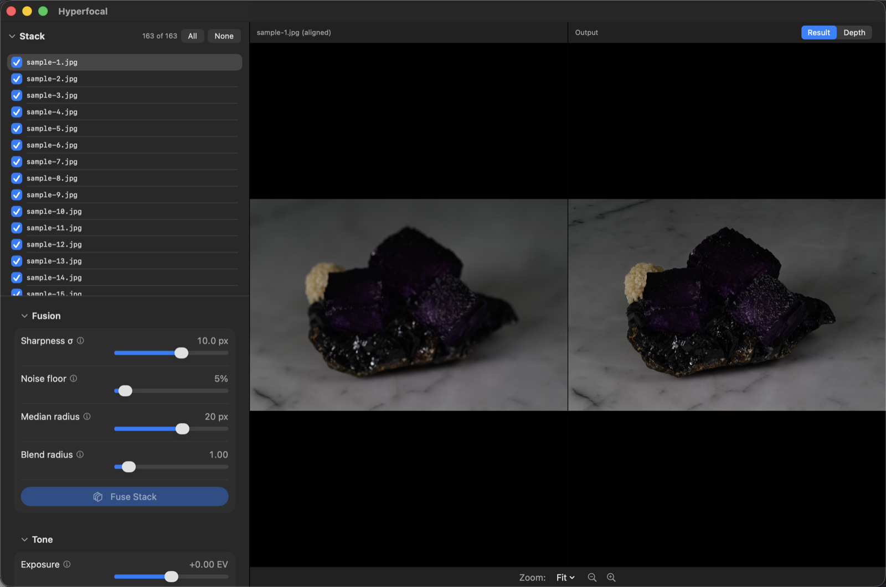
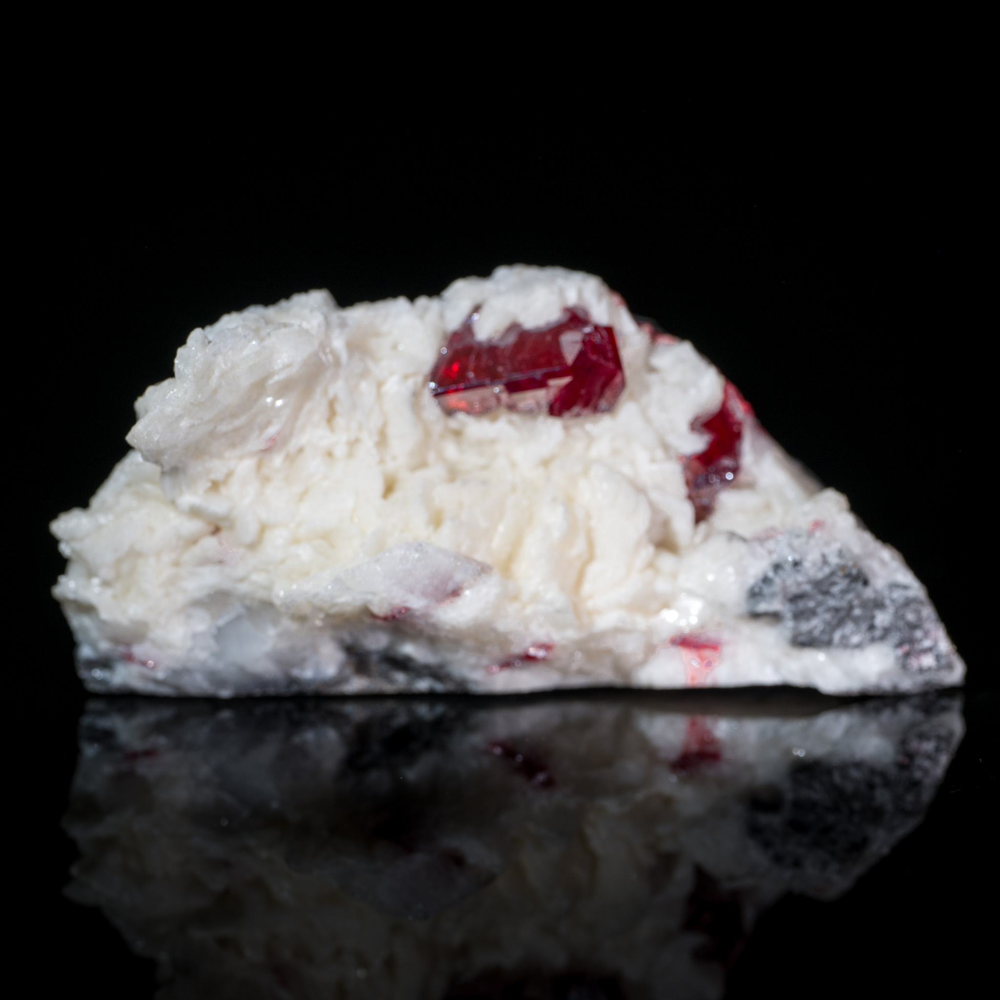
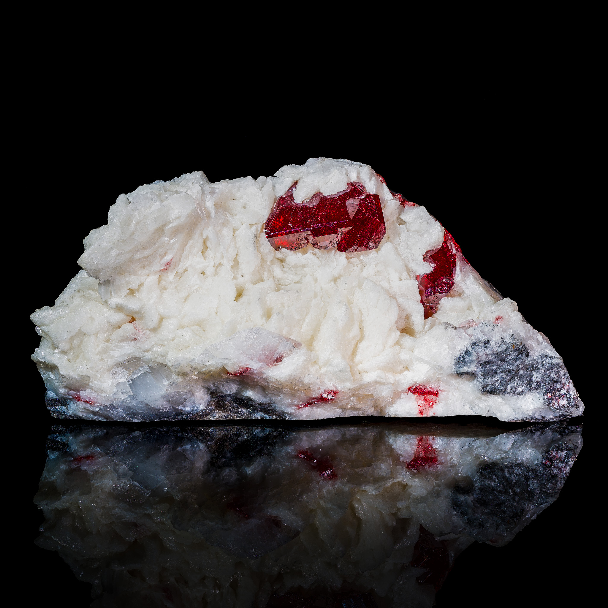

# Hyperfocal

A free, open-source, cross-platform focus stacking application.

[Website](https://ethannicholas.com/hyperfocal) ·
[Tutorial](https://ethannicholas.com/hyperfocal/tutorial.html)



## What it does

A camera lens focuses at a single depth plane, and only that plane is
perfectly sharp. That's often fine, and having a blurred background can be
desirable for subject separation. But sometimes, especially with macro
photography, a shallow depth of field is unpleasant and distracting because
you'd rather have the entire subject in focus at once. The solution to this
problem is *focus stacking*: shoot many, often dozens or hundreds, of frames
each with slightly different focus, and then merge the sharpest parts of each
into one image that has everything you care about in focus at once.

Hyperfocal performs that merge step for you. Drop in a folder of frames and it
handles every part of the focus stacking process — aligning all of the frames
to deal with focus breathing and slight shifts, scoring per-pixel sharpness
across the stack, and rendering a result that takes each pixel from the
sharpest frames. And because no focus stacking algorithm can perfectly deal
with complicated objects having translucency, small projections, and the like,
Hyperfocal offers powerful retouching features so you can obtain a flawless
result every time.

|  |  |
|:--:|:--:|
| *In this single shot, only a small part of this cinnabar specimen is in focus* | *After fusing dozens of similar shots in Hyperfocal, the entire specimen is sharp* |

## Highlights

- **GPU accelerated.** Hyperfocal takes maximum advantage of Apple Silicon,
  using compute shaders to run its algorithms on the GPU wherever possible.
  Registration, warping, sharpness scoring, and depth regularization are all
  GPU-accelerated.

- **Two fusion engines.** A depth-map engine with halo-aware regularization
  for clean subjects, and Laplacian-pyramid (PMax) fusion for scenes where
  structures at different depths overlap. Retouching lets you combine the
  strengths of both algorithms in a single image.

- **Thoughtful features.** You shot several stacks in the same folder? No
  problem, Hyperfocal notices the gap in frame timestamps and offers to import
  them as separate stacks. Turns out the flash didn't fire on some frames? It
  notices and offers to exclude the offending images rather than destroy your
  stack. Hyperfocal was created by an experienced macro photographer familiar
  with the process and its challenges.

- **Retouching that understands stacks.** Paint from any source frame, jump to
  the sharpest frame under the brush, blend in the PMax rendering where it
  produced better results, or paint back to the original fusion. Strokes
  repair the depth map along with the pixels — flip the output pane to Depth
  while retouching and watch artifacts disappear from both.

- **Non-destructive editing.** Lightroom-style tone controls and a rotatable
  crop, applied to previews and baked into exports, saved per stack in the
  project, and undoable (⌘Z covers tone, crop, frame selection, and retouch
  strokes).

- **Raw in, raw out.** Supports camera raw (NEF, DNG, CR3, ARW, …) input,
  working in Display P3 end to end, and produces DNG output. Or you can stick
  to JPG / TIFF if you prefer.

- **Rocking animations.** Export a short looping video that rocks the result
  left and right, using the computed depth map for parallax — the depth your
  stack captured becomes visible motion. Choose the path, speed, strength,
  and format (MP4 or loop-forever GIF).

- **Projects and batches.** Multi-stack projects with per-stack results and
  retouch state, a queue that fuses every stack in a session, and export-all.

## Get Hyperfocal

If you'd prefer to skip the build process and the hassle of keeping it up to
date (and give the author a small tip in the process), Hyperfocal is available
from the Mac App Store for $5.

### Building on macOS

To build it yourself for free, you'll need Xcode and
[XcodeGen](https://github.com/yonaskolb/XcodeGen) (`brew install xcodegen`):

```sh
git clone https://github.com/ethannicholas/hyperfocal.git
cd hyperfocal/App
xcodegen generate
open Hyperfocal.xcodeproj
```

Then run from Xcode. You will need to change the signing certificate to your
own or to "Sign to Run Locally".

### Building on Linux

The Linux port is under active development. The engine and the
command-line tool build and pass the same regression gates as on macOS;
the desktop app is a Qt shell that already runs but isn't a finished
product yet (some editing features are still macOS-only).

To install the prerequisite libraries on Ubuntu:

```sh
sudo apt install swiftlang build-essential pkg-config \
    libraw-dev liblcms2-dev libexiv2-dev libjpeg-turbo8-dev \
    libtiff-dev libpng-dev zlib1g-dev libopencv-dev cmake \
    qt6-base-dev qt6-declarative-dev qt6-shadertools-dev
```

(On other distributions, install a Swift 6 toolchain from
[swift.org](https://www.swift.org/install/) and the equivalent `-dev`
packages.)

Then build and run:

```sh
QtShell/build.sh --run
```

New to focus stacking? Take a look at the
[tutorial](https://ethannicholas.com/hyperfocal/tutorial.html).

## How it works

1. **Registration.** Each frame is registered against its neighbor (adjacent
   frames in a focus ramp share the most in-focus content) using Vision
   homographic registration on gradient-magnitude images, which keeps the
   defocused content from dragging the alignment. Only the chained 3×3
   matrices are kept. This handles focus breathing, translation, and rotation;
   the output canvas is cropped to the region every frame covers.

2. **Fusion.** Each frame is decoded once, warped into reference coordinates
   (Lanczos-3 with an anti-ringing clamp), folded into fixed-size accumulator
   planes, and freed. The default `dmap` engine scores per-pixel sharpness
   across the stack, builds a depth map — which frame is sharpest at every
   pixel — cleans it up with a confidence-weighted median and an edge-aware
   guided filter (sharp subjects keep their exact winning frame; featureless
   regions form smooth ramps; depth stops dead at subject silhouettes, which
   is what prevents halos), then renders by blending each pixel from the
   frames nearest its depth. The `pmax` engine is Laplacian-pyramid
   max-coefficient fusion, better where structures at different depths
   overlap.

3. **Export.** 16-bit TIFF/PNG or JPEG in sRGB, Display P3, or ProPhoto; or
   Linear DNG (written through the vendored Adobe DNG SDK) that Lightroom and
   Adobe Camera Raw open as an editable raw file, with tone edits embedded as
   Camera Raw settings. Every format carries the first frame's EXIF —
   exposure, lens, camera, GPS.
