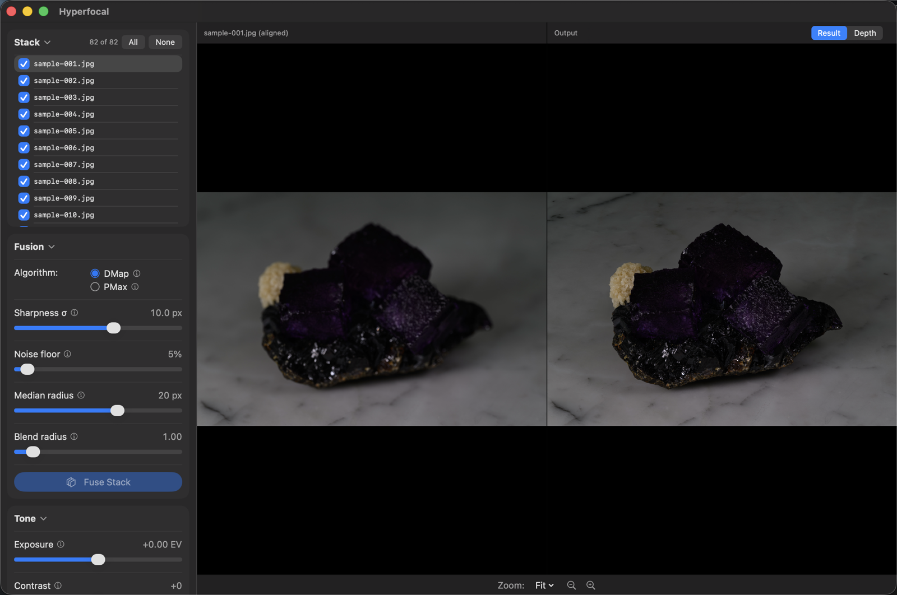
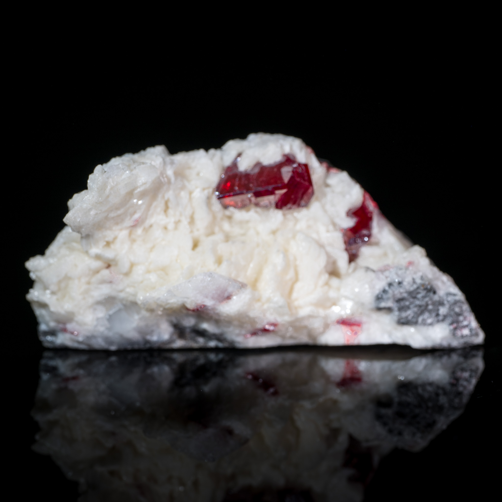
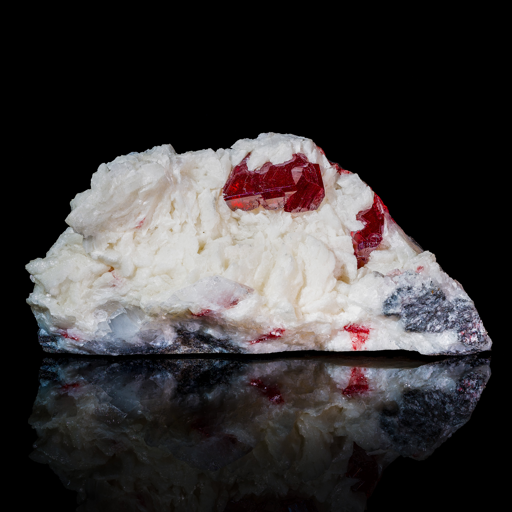

# Hyperfocal

A free, open-source, cross-platform focus stacking application.

[Website](https://ethannicholas.com/hyperfocal) ·
[Tutorial](https://ethannicholas.com/hyperfocal/tutorial.html)



## What it does

A camera lens focuses at a single depth plane, and only that plane is
perfectly sharp. That's often fine, and having a blurred background can be
desirable for subject separation. But sometimes, especially with macro
photography, a shallow depth of field is unpleasant and distracting because
you'd rather have the entire subject in focus at once. The solution to this
problem is *focus stacking*: shoot many, often dozens or hundreds, of frames
each with slightly different focus, and then merge the sharpest parts of each
into one image that has everything you care about in focus at once.

Hyperfocal performs that merge step for you. Drop in a folder of frames and it
handles every part of the focus stacking process — aligning all of the frames
to deal with focus breathing and slight shifts, scoring per-pixel sharpness
across the stack, and rendering a result that takes each pixel from the
sharpest frames. And because no focus stacking algorithm can perfectly deal
with complicated objects having translucency, small projections, and the like,
Hyperfocal offers powerful retouching features so you can obtain a flawless
result every time.

|  |  |
|:--:|:--:|
| *In this single shot, only a small part of this cinnabar specimen is in focus* | *After fusing dozens of similar shots in Hyperfocal, the entire specimen is sharp* |

## Highlights

- **GPU accelerated, on every platform.** Hyperfocal runs its algorithms on the
  GPU wherever possible — warping, sharpness scoring, depth regularization and
  both fusion engines — through Metal compute shaders on macOS and WebGPU
  compute shaders on Windows. Each is held to a measured agreement bar against
  the CPU engine, so the answer doesn't depend on which one ran, and either
  falls back to the CPU automatically on a machine with no usable GPU, so a
  fuse always completes. (Linux builds from source can switch the same backend
  on; the Store package for it isn't built yet.)

- **Two fusion engines.** A depth-map engine with halo-aware regularization
  for clean subjects, and Laplacian-pyramid (PMax) fusion for scenes where
  structures at different depths overlap. Retouching lets you combine the
  strengths of both algorithms in a single image.

- **Thoughtful features.** You shot several stacks in the same folder? No
  problem, Hyperfocal notices the gap in frame timestamps and offers to import
  them as separate stacks. Turns out the flash didn't fire on some frames? It
  notices and offers to exclude the offending images rather than destroy your
  stack. Hyperfocal was created by an experienced macro photographer familiar
  with the process and its challenges.

- **Retouching that understands stacks.** Paint from any source frame, jump to
  the sharpest frame under the brush, blend in the PMax rendering where it
  produced better results, or paint back to the original fusion. Strokes
  repair the depth map along with the pixels — flip the output pane to Depth
  while retouching and watch artifacts disappear from both.

- **Non-destructive editing.** Lightroom-style tone controls and a rotatable
  crop, applied to previews and baked into exports, saved per stack in the
  project, and undoable (⌘Z covers tone, crop, frame selection, and retouch
  strokes).

- **Raw in, raw out.** Supports camera raw (NEF, DNG, CR3, ARW, …) input,
  working in Display P3 end to end, and produces DNG output. Or you can stick
  to JPG / TIFF if you prefer.

- **Rocking animations.** Export a short looping video that rocks the result
  left and right, using the computed depth map for parallax — the depth your
  stack captured becomes visible motion. Choose the path, speed, strength,
  and format (H.264 MP4, or a loop-forever GIF).

- **Projects and batches.** Multi-stack projects with per-stack results and
  retouch state, a queue that fuses every stack in a session, and export-all.

## Get Hyperfocal

If you'd prefer to skip the build process and the hassle of keeping it up to
date (and help fund its development in the process), Hyperfocal is available
from the [Mac App Store](https://apps.apple.com/us/app/hyperfocal-focus-stacker/id6789574802).

The Mac build requires **macOS 14 or later on Apple silicon**; Intel Macs are
not supported.

### Building on macOS

To build it yourself for free, you'll need Xcode and
[XcodeGen](https://github.com/yonaskolb/XcodeGen) (`brew install xcodegen`):

```sh
git clone https://github.com/ethannicholas/hyperfocal.git
cd hyperfocal
Scripts/run.sh                 # build and launch
Scripts/build.sh               # ...or build it without launching
```

No Apple Developer account is needed: the app is signed to run locally.

To work on it in Xcode instead, `cd App && xcodegen generate && open
Hyperfocal.xcodeproj` — the generated project builds and runs as-is, with no
signing settings to change.

### Building on Linux

To install the prerequisite libraries on Ubuntu:

```sh
sudo apt install swiftlang build-essential pkg-config \
    libraw-dev liblcms2-dev libjpeg-turbo8-dev libgif-dev \
    libtiff-dev libpng-dev zlib1g-dev libopencv-dev \
    libopenh264-dev cmake \
    qt6-base-dev qt6-declarative-dev qt6-shadertools-dev
```

(On other distributions, install a Swift 6 toolchain from
[swift.org](https://www.swift.org/install/) and the equivalent `-dev`
packages.)

The GPU compute backend needs a pinned wgpu-native prebuilt, fetched once. It
is not an opt-in — the build stops if it is missing:

```sh
Scripts/fetch-wgpu.sh          # -> ../wgpu-native, or wherever WGPU_ROOT points
```

Then build and run:

```sh
Scripts/run.sh --qt
```

### Building on Windows

Prerequisites (installable via winget except vcpkg and Qt):

- **Visual Studio 2022 Build Tools** with the MSVC tools for your
  architecture and a Windows 11 SDK
  (`Microsoft.VisualStudio.Component.VC.Tools.x86.x64` or `.ARM64`, and
  `...Windows11SDK.26100`)
- **Swift toolchain** from [swift.org](https://www.swift.org/install/)
  (`winget install Swift.Toolchain`)
- **CMake** and **Ninja**
- **Qt 6** (qtbase, qtdeclarative, qtshadertools) for the desktop app —
  easiest via [aqtinstall](https://github.com/miurahr/aqtinstall):
  `pip install aqtinstall`, then

  ```powershell
  aqt install-qt windows desktop 6.10.3 win64_msvc2022_64 `
      -m qtshadertools --outputdir C:\Qt
  ```

  On ARM64 use `win64_msvc2022_arm64_cross_compiled` instead.
  `Scripts\windows-env.ps1` finds the newest `C:\Qt\6.x` kit matching the
  machine's architecture on its own; set `QT_KIT` to override.
- **vcpkg**, checked out beside this repo (or point `VCPKG_ROOT` at it),
  with the imaging libraries installed — use `arm64-windows` on ARM64
  machines:

```powershell
git clone https://github.com/microsoft/vcpkg.git ..\vcpkg
..\vcpkg\bootstrap-vcpkg.bat -disableMetrics
..\vcpkg\vcpkg install zlib tiff libpng libjpeg-turbo lcms giflib `
    "libraw[dng-lossy]" "opencv4[core,calib3d]" --triplet x64-windows
```

- **wgpu-native**, for the GPU compute backend — a pinned prebuilt, fetched by
  `Scripts\fetch-wgpu.sh` (Git Bash; it lands in `..\wgpu-native` by default,
  or wherever `WGPU_ROOT` points). **Required**: GPU fusion is not an opt-in on
  Windows, so the build stops if it is missing.

Windows **Developer Mode** must be enabled (Settings → System → For
developers): Swift package checkouts contain symlinks.

Then, in PowerShell:

```powershell
bash Scripts/fetch-wgpu.sh    # Git Bash, once; -> ..\wgpu-native
. Scripts\windows-env.ps1     # loads the Swift + MSVC + vcpkg + wgpu environment
swift build -c release
.build\release\hyperfocal-cli --help
Scripts\run.ps1               # build and launch the desktop app
Scripts\build.ps1             # ...or build it without launching
```

GPU fusion is compiled in — there is no CPU-only build to opt out of, and the
same binary falls back to the CPU at runtime when no usable adapter is present.
To check the two paths against each other:

```powershell
.build\release\hyperfocal-cli debug-wgpu   # CPU vs GPU parity gates
```

To produce the Microsoft Store package — the app plus every Qt, Swift, imaging
and GPU DLL it needs, the third-party notices and license texts, and the signed-
by-the-Store MSIX:

```powershell
Scripts\package-windows.ps1   # -> dist\Hyperfocal-<version>-<arch>\ and .msix
```

**High-Efficiency NEFs (and other undecodable raws).** LibRaw can't decode
Nikon High-Efficiency (HE/HE\*) NEFs or cameras newer than itself. When
Hyperfocal hits one, it transcodes it to a cached DNG via the free
[Adobe DNG Converter](https://helpx.adobe.com/camera-raw/using/adobe-dng-converter.html)
and decodes that transparently — no action needed once the converter is
installed (converted DNGs are cached in `%LOCALAPPDATA%\Hyperfocal\DNGCache`).
If it isn't installed, the app points you to the download page. Set
`HYPERFOCAL_DNG_CONVERTER` to the converter's `.exe` to override the standard
install location. (macOS decodes these formats natively and needs none of
this.)

### Getting Started

Once you've gotten Hyperfocal running, take a look at the
[tutorial](https://ethannicholas.com/hyperfocal/tutorial.html) for a
walkthrough of its basic features.

## How it works

1. **Registration.** Each frame is registered against its neighbor (adjacent
   frames in a focus ramp share the most in-focus content) by homographic
   registration on gradient-magnitude images — Vision on macOS, OpenCV
   elsewhere — which keeps the defocused content from dragging the alignment.
   Only the chained 3×3 matrices are kept. This handles focus breathing,
   translation, and rotation; the output canvas is cropped to the region every
   frame covers.

2. **Fusion.** Each frame is decoded once, warped into reference coordinates
   (Lanczos-3 with an anti-ringing clamp), folded into fixed-size accumulator
   planes, and freed. The default `dmap` engine scores per-pixel sharpness
   across the stack, builds a depth map — which frame is sharpest at every
   pixel — cleans it up with a confidence-weighted median and an edge-aware
   guided filter (sharp subjects keep their exact winning frame; featureless
   regions form smooth ramps; depth stops dead at subject silhouettes, which
   is what prevents halos), then renders by blending each pixel from the
   frames nearest its depth. The `pmax` engine is Laplacian-pyramid
   max-coefficient fusion, better where structures at different depths
   overlap.

3. **Export.** 16-bit TIFF/PNG or JPEG in sRGB, Display P3, or ProPhoto; or
   Linear DNG (written through the vendored Adobe DNG SDK) that Lightroom and
   Adobe Camera Raw open as an editable raw file, with tone edits embedded as
   Camera Raw settings. Every format carries the first frame's EXIF —
   exposure, lens, camera, GPS.
